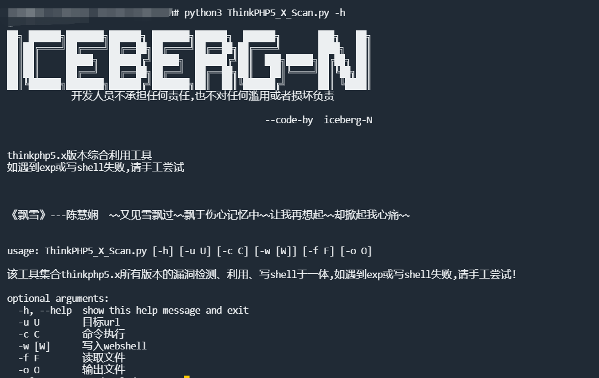
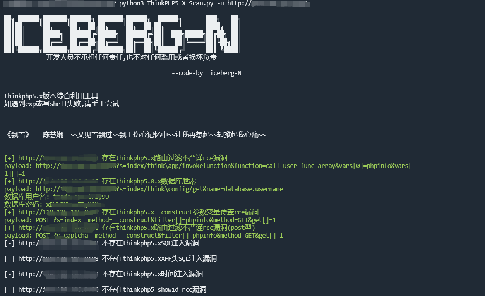
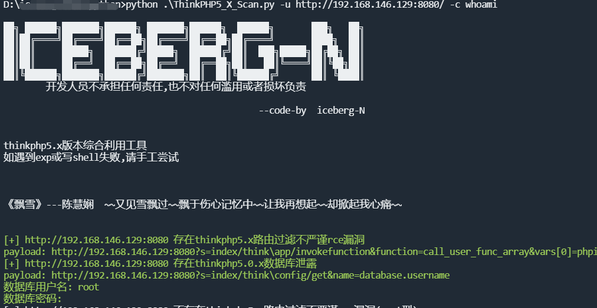
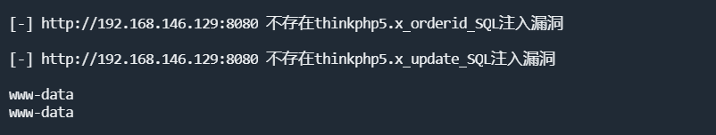
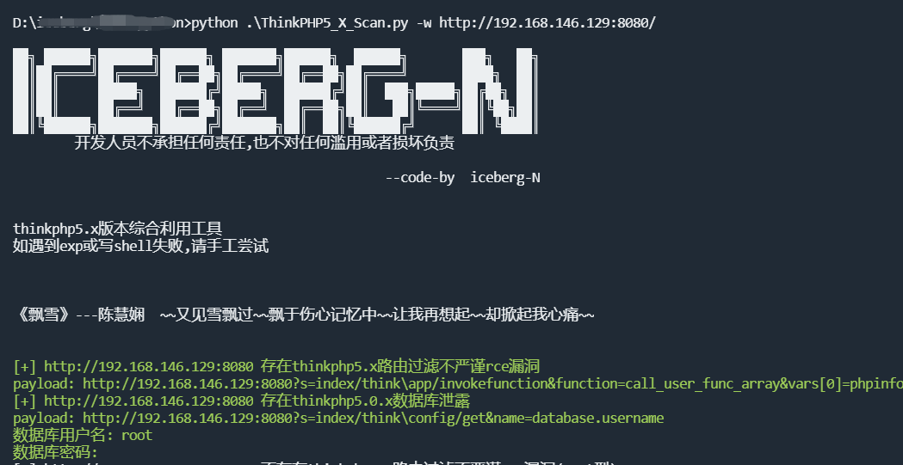
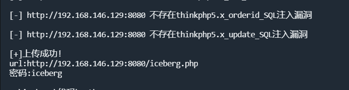
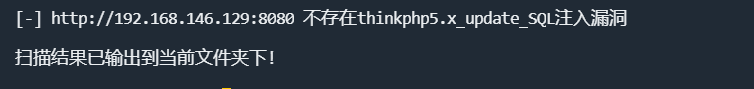

# Thinkphp5.x_Scan
----
thinkphp5.x(tp5)所有版本的漏洞检测、利用、写shell工具!!!

仅支持rce的利用和写webshell，如遇到exp或写shell失败,请手工尝试!


# 功能特点
***
**支持漏洞检测**
***
POC种类：
```
check_5_x_route_rce
check_5_0_x_db
check_5_x_construct_rce 
check_5_x_construct_other
check_5_x_sql
check_5_x_xff_sql 
check_5_x_time_sql  
check_5_x_driver_rce  
check_5_x_showid_rce
check_5_x_request_input_rce 
check_5_x_template_driver_rce  
check_5_x_cache_rce  
check_5_x_ids_sql
check_5_x_orderid_sql  
check_5_x_update_sql
```

**支持漏洞利用**
***
不包含数据库泄露、SQL注入利用
如果检测出不止一个POC，第一个利用失败则自动利用下一个POC，利用失败，请自行用payload尝试！

**支持上传webshell**
***
支持上传一句话木马
如果检测出不止一个，则第一个上传失败后则自动利用下一个POC继续上传！

# 使用方法

## 环境准备
***
```
git clone https://github.com/iceberg-N/thinkphp5.x_Scan.git
```

## 使用方法
***
-h 提供命令帮助文档


**单个目标**
只有域名，默认为http
```
python3 ThinkPHP5_X_Scan.py -u http://example.com
```



**漏洞利用**

```
python3 ThinkPHP5_X_Scan.py -u http://example.com -c whoami
```





**上传webshell**
支持一句话木马，webshell名为"iceberg.php"，密码为"iceberg"
```
python3 ThinkPHP5_X_Scan.py -w http://example.com
```





**批量检测**
支持txt格式
```
python3 ThinkPHP5_X_Scan.py -f ./ip.txt -o ./result.txt
```



